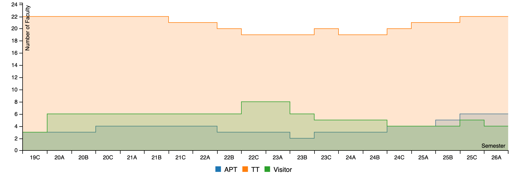
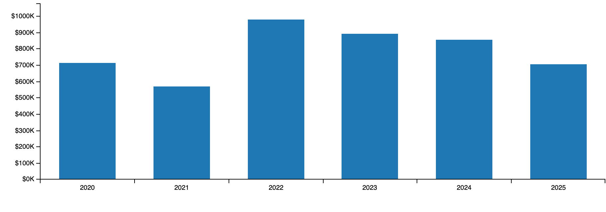
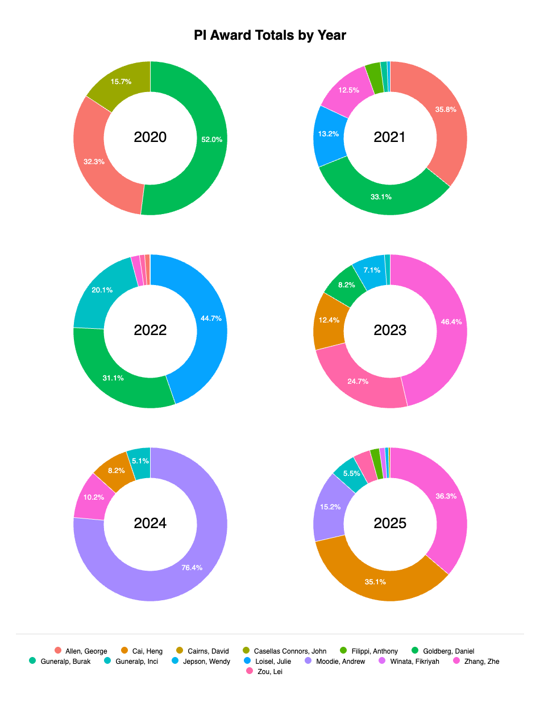
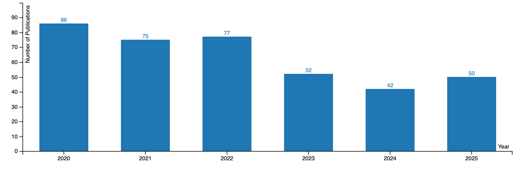
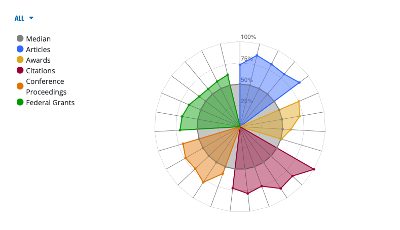

```{r initialization}
#| echo: false
#| warning: false
#| error: false
#| context: data

library(dplyr)
source(".//R//Functions.R")
```

# APR Template -- AY25-26

::: {custom-style="YellowOutlineBox"}
PLEASE NOTE: Do not remove instructions.  They will be removed prior to distribution to the ERT.  Address each of the elements listed in each section in the order presented.
:::

::: {custom-style="CustomSection-Level1"}
**SECTION I: Executive Summary**
:::

::: {custom-style="BlueOutlineBox"}
**PLEASE NOTE:** The Executive Summary should simply update the summary document provided to the ERT members with their invitation to participate (approximately 2 pages).
:::

::: {custom-style="CustomSection-Level2"}
**A.\Department Overview**
:::


::: {custom-style="CustomSection-Level3"}
1.\ Overview of the department and **all** degree program(s) offered by the department. Please note any programs that are accredited or new (within the last year).
::: 


::: {custom-style="CustomSection-Level2"}
**B\. Faculty/Staff Overview**
:::

::: {custom-style="CustomSection-Level3"}
Overview of the number of faculty, staff, and approximate number of students (undergraduate and graduate) in the department/program as of September 1, 2025.(Needs 1 at beginning)
::: 

::: {custom-style="CustomSection-Level1"}
SECTION II: Department Overview and Infrastructure
:::

::: {custom-style="BlueOutlineBox"}
**PLEASE NOTE:** At a minimum, the following documents must be mentioned in the narrative:\
Institutional Summary\
Institutional Strategic Plan / Decade of Excellence\
College/School Strategic Plan (if available)\
Department Strategic Plan (if available)\

These documents will be provided to the ERT members by the Office of Academic Effectiveness & Planning.
:::

::: {custom-style="CustomSection-Level2"}
**Mission and Strategic Priorities**
:::

::: {custom-style="CustomSection-Level3"}
1Include a summary of the strategic priorities for the department, the college/school, and the University as they relate specifically to academic programs.
:::

::: {custom-style="CustomSection-Level3"}
2Include an organizational chart and descriptions (and membership) of departmental committees.
:::

::: {custom-style="CustomSection-Level2"}
**External Program Accreditation (if applicable)**
::: 

::: {custom-style="CustomSection-Level3"}
1List any professionally accredited or credentialed programs offered in the department (include date and outcome of last review).
:::

::: {custom-style="CustomSection-Level2"}
**Facilities**
:::

::: {custom-style="CustomSection-Level3"}
1\. Include space and equipment used for the delivery of the programs addressed in the APR and related activities (e.g., research).
:::

::: {custom-style="CustomSection-Level2"}
**Budget**
:::

::: {custom-style="CustomSection-Level3"}
1Include faculty and staff salaries, graduate stipends/support, operating funds (noting faculty and student support that may be within the department's operating funds budget), sources of funds, etc.
:::

**Figure 1: Budget breakdown for Geography (FY2020 - FY2025)**

::: {custom-style="CustomSection-Level1"}
SECTION III: Academic Program(s) Overview
:::

::: {custom-style="BlueOutlineBox"}
**PLEASE NOTE:** Provide information on **all academic programes offered by the department, including accredited degrees and certificates, in the Overview (A).  Unless otherwise indicated, all subsequent sections should focus on the degrees that are included in the APR review (that is, all undergraduate and graduate, non-accredited degrees).
:::

::: {custom-style="CustomSection-Level2"}
**A. Overview of Academic Programs**
::: 

::: {custom-style="CustomSection-Level3"}
1. Provide a brief overview of **all** academic programs offered by the department (noting any that are professionally accredited and thus not a part of the APR review or new programs).
:::

::: {custom-style="CustomSection-Level3"}
2. Although not included in the review, please include certificates and/or minors offered by the department as well in this overview.]
:::

The Department of Geography offers minors in Geography and GIST. Graduate certificate programs are available in Geospatial Intelligence, GIS, and Remote Sensing.

::: {custom-style="CustomSection-Level2"}
**B. Peer/Aspirant Programs**
:::

::: {custom-style="CustomSection-Level3"}
1. Identify 5 -- 8 peer/aspirant programs that most closely align with programs under review. Focus on programs offered at public, R1 peer institutions. Briefly describe how these programs were identified and what is particularly noteworthy about the programs.]{.mark}
:::

::: {custom-style="CustomSection-Level2"}
**C. Degree Programs**
:::

::: {custom-style="CustomSection-Level3"}
1. List the academic degree programs addressed in the APR in the table below (thus, all degrees other than those that are professionally accredited), include mode of delivery or location if other than face-to-face in College Station.
:::

::: {custom-style="CustomSection-Level3"}
2Add (or delete rows) as needed so that all degrees are included.
:::

::: {custom-style="CustomSection-Level2"}
D. **Degrees Included in the Review**
:::

| **Level (BS, MS, etc.)** | **Program Name** | **Emphases/Tracks (if applicable)** | **Mode of Delivery/Location** | **URL - Catalog** |
|---|---|---|---|---|


::: {custom-style="CustomSection-Level2"}
**Baccalaureate Degrees**
:::

::: {custom-style="CustomSection-Level2"}
**A. Program Learning Outcomes**
:::

::: {custom-style="CustomSection-Level3"}
1\. For each (non-accredited) baccalaureate degree, provide the program learning outcomes followed by the curricular requirements (Add rows as necessary; take out sections that are not applicable).
:::

::: {custom-style="CustomSection-Level2"}
**B. Admissions**
:::

::: {custom-style="CustomSection-Level3"}
1\. Summarize the admissions **criteria** for the baccalaureate degree(s).
:::

::: {custom-style="CustomSection-Level3"}
2\. Provide a brief description of the admissions **process** for the baccalaureate degree(s).
:::

::: {custom-style="CustomSection-Level2"}
**Graduate Degrees**
:::

::: {custom-style="CustomSection-Level2"}
**A. Program Learning Outcomes**
:::


::: {custom-style="CustomSection-Level3"}
1\. For each (non-accredited) graduate degree, provide the program learning outcomes followed by the curricular requirements (Add rows as necessary; take out sections that are not applicable).
:::


**A. Admissions**

1\. Summarize the admissions **criteria** for the graduate degree(s). Provide criteria for each graduate degree separately.

2\. Provide a brief description of the admissions **process** for the graduate degree(s).

**B. Curricular Changes**

1\. Summarize any substantive curricular changes made since the last review (e.g., new programs, program phase outs, changes to mode of delivery, changes to administrative location of programs).

2\. Summarize any pending changes to the programs presented above (i.e., curricular changes routed through CARS for AY25-26)

3\. Outlined any proposed changes in development or pending for AY26-27.

**Curricular Changes**

**1. Background**

**2. Curricular Plans**

**MS and PhD Programs**

**MS and PhD - Additional Curricular Offerings**

::: {custom-style="CustomSection-Level1"}
SECTION IV: Summary of the Last APR
:::

::: {custom-style="BlueOutlineBox"}
**PLEASE NOTE:** If this is the first APR review for the programs in the department, simply note this section is not applicable.  Documentation from the previuos review is available in the Google Drive shared with the department head/program director.
:::

::: {custom-style="CustomSection-Level2"}
**AFindings and Action Plan**
:::

::: {custom-style="CustomSection-Level3"}
1Provide the date of the last review, list the members of the external review team, and reference the following attachments:

a. The last ERT Report[^ert]

b. The Institutional Response submitted to the THECB[^response]

c. The 1-Year Status Report[^status1]

d. The 4-Year Status Report[^status4]
:::

::: {custom-style="CustomSection-Level2"}
**B. Recent Actions**
:::

::: {custom-style="CustomSection-Level3"}
1Summarize actions taken since the last Status Report related to recommendations provided by the External Review Team (ERT).
:::

::: {custom-style="CustomSection-Level2"}
**C. Structural Changes of Note**
:::

::: {custom-style="CustomSection-Level3"}
1.\ Provide a summary of any significant structural changes to the programs under review since the last APR (e.g., new programs, program inactivations, changes to mode of delivery, changes to administrative location of programs).
:::

::: {custom-style="CustomSection-Level1"}
SECTION V: Program Assessment and Metrics
:::

::: {custom-style="BlueOutlineBox"}
**PLEASE NOTE:** Complete both tables provided below for each degree included in the review (thus non-accredited).\
\
:::

::: {custom-style="CustomSection-Level2"}
**A. Program Learning Outcomes, Assessment Strategies, and Continuous Improvement**
:::

::: {custom-style="CustonSection-Level3"}
1.\ List the Program-level **Student Learning Outcomes** **by degree**[^sloprog] included in the review. For the table below, the first two columns can be copied from Section 3 and then fill out the final column.
:::

**BS Geography**

**BS Geographic Information Science and Technology **

**MS Geography**

**PhD Geography**

::: {custom-style="CustomSection-Level4"}
a. In the narrative, summarize the results from previous student learning outcome assessments.
:::

::: {custom-style="CustomSection-Level4"}
b. Discuss (1-3) improvements made based on results of the program's assessment of learning outcomes (by program) over the last 2-3 years.
:::

::: {custom-style="CustomSection-Level2}
**B. Program Metrics**
:::

(for the previous 5 years, **by degree**)

```{r program_metrics}
#| results: 'asis'
#| echo: false

table_data <- as.data.frame(params$table1Data)
allPrograms <- unique(table_data$shortProgram)

for (singleProgram in allPrograms) {
  # Use cat() instead of print() when using results: 'asis'
  cat(createTable1_kable(table_data, params$theDept, singleProgram))
  cat("\n\n")
}
  
```

:::{custom-style="CustomSection-Level3"}
1\. Analysis
```{r}
#| eval: !expr params$selectedViz$retention_trend
#| echo: false

create5yrTrendRetentionChart(params$table1Data, params$theDept, params$theDegrees)
```
:::

:::{custom-style="CustomSection=Level4"}
a. Discuss the degree program's progress and efforts related to retention and graduation rates, time to degree, degrees awarded, and placement upon graduation.
:::

::: {custom-style="CustomSection-Level1"}
SECTION VI: Student Profile
:::

::: {custom-style="BlueOutlineBox"}
**PLEASE NOTE: Most of the data requested in this section is available at** https://accountability.tamu.edu/Student-Metrics or TAMU by the Numbers.  Student data certified after November 1st.
:::

:::{custom-style="CustomSection-Level2"}
**A. Overview of Students**
:::

:::{custom-style="CustomSection-Level3"}
1\. Provide an overview of students including any unique characteristics.
:::

:::{custom-style="CustomSection-Level2"}
**B. Matriculation Data**
:::

:::{custom-style="CustomSection-Level3"}
1\. Provide the following data for the last 5 academic years (Fall 20 -- Fall 24) **by academic program** included in the current APR. Go to this link [https://abpa.tamu.edu/accountability-metrics/student-metrics/applied-admitted-enrolled](https://abpa.tamu.edu/accountability-metrics/student-metrics/applied-admitted-enrolled).
:::

:::{custom-style="CustomSection-Level2"}
**Applied/Admitted/Enrolled**
:::

::: {custom-style="CustomSection-Level3"}
**Degree[^degreetable]: BS Geography**
:::

| Fall | **Applied** | **Admitted** | **Enrolled** | **Percent Enrolled** |
|---|---|---|---|---|
| **2020** | 9 | 3 | 1 | 33% |
| **2021** | 8 | 5 | 2 | 40% |
| **2022** | 12 | 6 | 5 | 83% |
| **2023** | 8 | 4 | 0 | 0% |
| **2024** | 13 | 5 | 2 | 40% |

::: {custom-style="CustomSection-Level3"}
**Degree: BS Geographic Information Science and Technology**
:::

| Fall | **Applied** | **Admitted** | **Enrolled** | **Percent Enrolled** |
|---|---|---|---|---|
| **2020** | 17 | 9 | 6 | 67% |
| **2021** | 15 | 9 | 4 | 44% |
| **2022** | 23 | 17 | 6 | 35% |
| **2023** | 17 | 10 | 4 | 40% |
| **2024** | 13 | 7 | 4 | 57% |

::: {custom-style="CustomSection-Level3"}
**Degree: MGSC Geoscience**
:::

| Fall | **Applied** | **Admitted** | **Enrolled** | **Percent Enrolled** |
|---|---|---|---|---|
| **2020** | 39 | 38 | 29 | 76% |
| **2021** | 20 | 20 | 16 | 80% |
| **2022** | 10 | 8 | 3 | 38% |
| **2023** | 9 | 8 | 7 | 88% |
| **2024** | 17 | 15 | 12 | 80% |
| **2025** | 16 | 15 | 13 | 87% |

::: {custom-style="CustomSection-Level3"}
**Degree: MS Geography**
:::


| Fall | **Applied** | **Admitted** | **Enrolled** | **Percent Enrolled** |
|---|---|---|---|---|
| **2020** | 22 | 14 | 8 | 57% |
| **2021** | 16 | 11 | 5 | 45% |
| **2022** | 14 | 9 | 5 | 56% |
| **2023** | 27 | 8 | 5 | 63% |
| **2024** | 23 | 15 | 3 | 20% |

::: {custom-style="CustomSection-Level3"}
**Degree: PhD Geography**
:::

| Fall | **Applied** | **Admitted** | **Enrolled** | **Percent Enrolled** |
|---|---|---|---|---|
| **2020** | 46 | 13 | 4 | 31% |
| **2021** | 34 | 28 | 11 | 39% |
| **2022** | 35 | 18 | 7 | 39% |
| **2023** | 43 | 17 | 8 | 47% |
| **2024** | 59 | 17 | 4 | 24% |
| **2025** | 82 | 28 | 12 | 43% |

::: {custom-style="CustomSection-Level3"}
**C. Institutional Support**
:::

::: {custom-style="CustomSection-Level3"}
1\. Discuss what is included, source of funds, challenges and opportunities related to financial support of graduate students.
:::

::: {custom-style="CustomSection-Level3"}
2\. Master's
:::

| **Academic Year** | **# Assisted** | **% Assisted** | **Average Amount**[^amtms] |
|---|---|---|---|
| **2020-2021** | **18** | **50% GAT** | **\$1,800 monthly pay; \$3,900 9hrs T&F** |
| **2021-2022** | **12.5** | **60% GAT** | **\$1,800 monthly pay; \$4,000 9hrs T&F** |
| **2022-2023** | **8** | **75% GAT** | **\$2,011.50 monthly pay** |
| **2023-2024** | **6** | **83% GAT** | **\$2,223 monthly pay** |
| **2024-2025** | **2** | **50% GAT** | **\$2,223 monthly pay** |

::: {custom-style="CustomSection-Level3"}
3\. Doctoral
:::

| **Academic Year** | **# Assisted** | **% Assisted** | **Average Amount**[^amtphd] |
|---|---|---|---|
| **2020-2021** | **25.5** | **61% GAT** | **\$1,900 monthly pay; \$3,900 9hrs T&F** |
| **2021-2022** | **31.5** | **56% GAT** | **\$1,900 monthly pay; \$4,000 9hrs T&F** |
| **2022-2023** | **43.5** | **61% GAT; 5% GAL** | **\$2,061.50 monthly pay; \$4,100 9hrs T&F** |
| **2023-2024** | **42.50** | **74% GAT; 2% GAL** | **\$2,223 monthly pay; \$4,100 9hrs T&F** |
| **2024-2025** | **38** | **79% GAT; 3% GAL** | **\$2,223 monthly pay; \$4,100 9hrs T&F** |

:::{custom-style="CustomSection-Level2"}
**D. Post-Graduation Placement**
:::

::: {custom-style="CustomSection-Level3"}
1\. Provide a summary of the post-graduation placement[^placement] for students by level (e.g., placement in a position related to their degree within one year of graduation; percentage who were accepted for an advanced degree).
:::

:::{custom-style="CustomSection-Level2"}
**E. Analysis**
:::


::: {custom-style="CustomSection-Level3"}
1\. Discuss any discernable trends in the data provided above and efforts undertaken to address any identified deficiencies.
:::

**MS and PhD Programs**

::: {custom-style="CustomSection-Level1"}
SECTION VII: Faculty Profile
:::

::: {custom-style="CustomSection-Level2"}
**A. Overview**
::: 

::: {custom-style="CustomSection-Level3"}
1\. Provide an overview of the faculty, include areas of expertise and number supporting the programs by level (e.g., number of faculty who focus their efforts on the undergraduate programs vs. graduate programs if applicable).
:::

Figure 2: Number of Faculty (2019-2025).

{width="6.9in" height="2.4166666666666665in"}

::: {custom-style="CustomSection-Level2"}
**B. Faculty Profile Data**
:::

::: {custom-style="CustomSection-Level3"}
1\. Complete each of the tables as indicated below (information can be provided using charts, graphs, etc.).
:::

| | **Tenure/Tenure Track Faculty** | **APT Faculty** |
|---|---|---|
| **Number (FTE) by Rank -- ** Graduate Assistantships can be found at the link on the right (there is a drop-down arrow on the left side of the screen and Graduate Assistantships is at the bottom of the drop down). | 21 | 8 |
| **Faculty/Student Ratio** (FTE faculty to student FTE) for the department for the most recent academic year | 13.83 | |
| **Faculty Publications** ([most recent 5 years]{.underline}) - Total number of faculty publications | \*\* source of data - **Academic Analytics** \*\* | |
| **External Grants** ([most recent 5 years]{.underline}) - Total dollars awarded (*attach a support document that lists all grants represented in the numbers provided*) | [https://abpa.tamu.edu/tamu-by-the-numbers/research-expenditures-and-budget](https://abpa.tamu.edu/tamu-by-the-numbers/research-expenditures-and-budget) | |
| **Average Teaching Load** | 3.5 / 2.47739 | |

Figure 3: Extramural (Federal) Research Expenditures 2020-2025.

{width="6.9in" height="2.4166666666666665in"}

Figure 4: Awarded External Funding by PI and Year.

{width="6.474782370953631in" height="8.442708880139982in"}

Figure 5: Journal publications for Department of Geography 2020-2025.

{width="6.9in" height="2.4166666666666665in"}

**Full-time Faculty as of the Fall Semester (Fall '25)**

| **Rank** | **Tenure/Tenure Track** | **APT** |
|---|---|---|
| Full | 9 | 0 |
| Associate | 6 | 3 |
| Assistant | 6 | 4 |
| **% with a terminal degree** | 100% | 85.7% |

::: {custom-style="CustomSection-Level2"}
**C. Faculty Qualifications** (i.e., expected qualifications for faculty by rank)
:::

::: {custom-style="CustomSection-Level3"}
1\. We will provide an Excel sheet with names of faculty and highest degree earned. Look the sheet over and then provide the summary areas of teaching and research specializations.
:::

::: {custom-style="CustomSection-Level2"}
**D. Analysis**
:::

::: {custom-style="CustomSection-Level3"}
1\. Discuss the extent to which the number of full-time faculty members is **sufficient** to support the mission of the program(s) under review and to ensure their quality and integrity.
:::

::: {custom-style="CustomSection-Level3"}
2\. Using the degree program(s) standards (i.e., Program Evaluation Metrics for faculty teaching, research, and service, as well as other relevant data such as annual reviews or other benchmark(s) discuss the faculty's overall performance.
:::

Figure 6: TAMU Geography Academic Productivity Radar (produced by Academic Analytics).

{width="6.9in" height="3.9722222222222223in"}

:::{custom-style="CustomSection-Level1"}
SECTION VIII: Identified Priorities and Opportunities for Improvement as a Result of the Self-Study Process
:::

Based on the self-study process:

:::{custom-style="CustomSection-Level2"}
**A. Opportunities**
:::

::: {custom-style="CustomSection-Level3"}
1\. What opportunities for improvement did the program faculty identify?
:::

::: {custom-style="CustomSection-Level2"}
**B. Priorities**
:::

::: {custom-style="CustomSection-Level3"}
1\. What priorities did the program faculty develop?
:::

::: {custom-style="CustomSection-Level2"}
**C. Feedback/Guidance**
:::

::: {custom-style="CustomSection-Level3"}
1\. Are there any specific areas for which the program faculty are particularly interested in ERT feedback/guidance? If so, list questions here.
:::

Appendix 1: Geography Strategic Plan (2014)

Appendix 2: College of Arts & Sciences Strategic Plan (2025)

[https://artsci.tamu.edu/about/strategic-plan/index.html](https://artsci.tamu.edu/about/strategic-plan/index.html)

Appendix 3: Geography ERT Report (2019)

Appendix 4: Institutional Response submitted to the THECB (2019)

Appendix 5: APR 1-year Status Report (2020)

Appendix 6: APR 4-year Status Report (2023)

Appendix 7: Research Grants Awarded

| Year | Researcher | Sponsor | Title | Award Amount |
|---|---|---|---|---|
| 2019 | Goldberg, Daniel | University of Minnesota | HealthPop: A Geocoding, Spatial Workflow and Contextual Data Integration Platform | \$77,000 |

Appendix 8: Research Expenditures

| Year | Researcher | Account Number | Total Expenditures |
|---|---|---|---|
| 2020 | Allen, George | 404811-00001 | \$562 |

[^ert]: Provided in the Google Drive.
[^response]: Provided in the Google Drive.
[^status1]: Provided in the Google Drive.
[^status4]: Provided in the Google Drive.
[^sloprog]: Duplicate this table as needed so to provide the information by program.
[^metricsprog]: Duplicate this table as needed so to provide the data by program.
[^grad4a]: Percent of a cohort who graduated on time, thus 4 and 6 years for undergraduate degrees.
[^grad6a]: Percent of a cohort who graduated on time, thus 4 and 6 years for undergraduate degrees.
[^grad4b]: Percent of a cohort who graduated on time, thus 4 and 6 years for undergraduate degrees.
[^grad6b]: Percent of a cohort who graduated on time, thus 4 and 6 years for undergraduate degrees.
[^gradmgsc]: Percent of a cohort who graduated on time, thus 4 years for undergraduate degrees, 2 years for masters degrees, and 4 years for doctoral degrees. If the expected time to degree is different, include a brief explanation regarding the anticipated time-to-degree for full-time students.
[^gradms]: Percent of a cohort who graduated on time, thus 4 years for undergraduate degrees, 2 years for masters degrees, and 4 years for doctoral degrees. If the expected time to degree is different, include a brief explanation regarding the anticipated time-to-degree for full-time students.
[^gradphd]: Percent of a cohort who graduated on time, thus 4 years for undergraduate degrees, 2 years for masters degrees, and 4 years for doctoral degrees. If the expected time to degree is different, include a brief explanation regarding the anticipated time-to-degree for full-time students.
[^degreetable]: Provide this table [for each degree]{.underline} offered by the department.
[^amtms]: Include assistantships if applicable; provide a brief narrative regarding the type of assistance represented (e.g., scholarships, financial aid, assistantships). If assistantships are available for master's students, state criteria for selection and average amount.
[^amtphd]: Provide a brief narrative regarding the type of assistance represented (e.g., scholarships, financial aid, assistantships). If assistantships are available for doctoral students, state criteria for selection and average amount.
[^placement]: Career Center data are available at [https://tableau.tamu.edu/t/StudentLifeStudies/views/CareerCenterSalarySurveyDashboardPUBLIC/SalaryTables?%3Aembed=y&%3AisGuestRedirectFromVizportal=y](https://tableau.tamu.edu/t/StudentLifeStudies/views/CareerCenterSalarySurveyDashboardPUBLIC/SalaryTables?%3Aembed=y&%3AisGuestRedirectFromVizportal=y). Other sources of data include exit/graduation survey data and Lightcast alumni pathways data (contact [APR@tamu.edu](mailto:APR@tamu.edu) for assistance).
